# FUTURE READY TALENT VIRTUAL INTERSHIP PROJECT

## PROJECT NAME - My Portfolio website hosted using static web app and assist the visitor using QnA maker azure Service.

 - You can check working azure function app by this http trigger :- https://polite-water-02c3b2c00.azurestaticapps.net/

## Resources used:
   - Azure Bot Services
   - Azure Resources
   - Visual studio code
   - Azure QnA Maker
   - Azure Static Web App

## Please watch this project demo and explanation video created by me for further idea and refference of my project :) (Click Below)

## Problem Statement/Opportunity :
- In this project i will face difficulty during crating my personal assistant bot service. this bot will help to the visitor, they will automatically guide easily without any difficulty. so it will take more to complete the project. however we can use cloud computing means like Azure service. they have inbuilt services so have to only connect. so we can easily complete our project work.
- There are lots of opportunity over there i will know about bot services, hosting services machine learning etc.

## Project Description :
- In this project i will going to solve problem is if some one have query regarding my website there will be the assistant and this assistant will help out there to the visitor.
- I will getting free hosting services for a while with free domain name.
- In this project i will using HTML, CSS, JavaScript, jQuery etc. with a very good UI i will integrate this QnA maker frame over there.
- I have placed the chat bot at bottom right corner with a anchor point, if i click on bot symbol then box will be appear and if again click on it then it will disappear.  

## Below you will find sample images :)

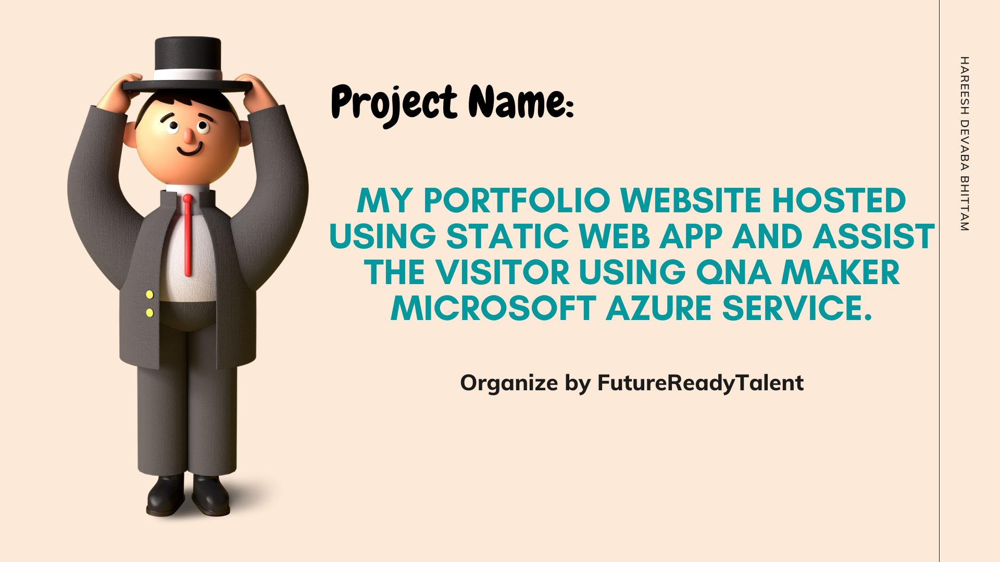

- CODE SNIPPET
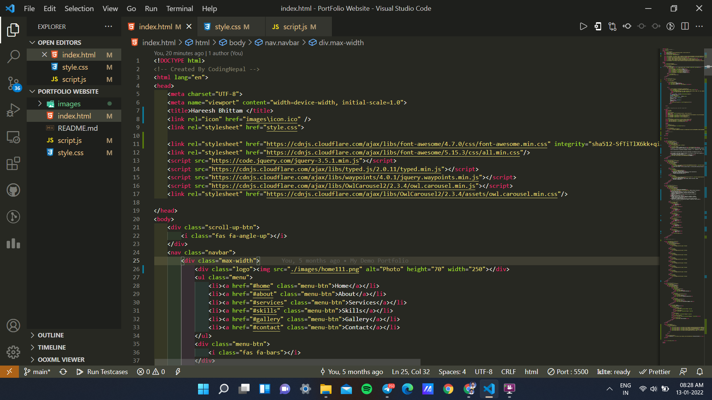

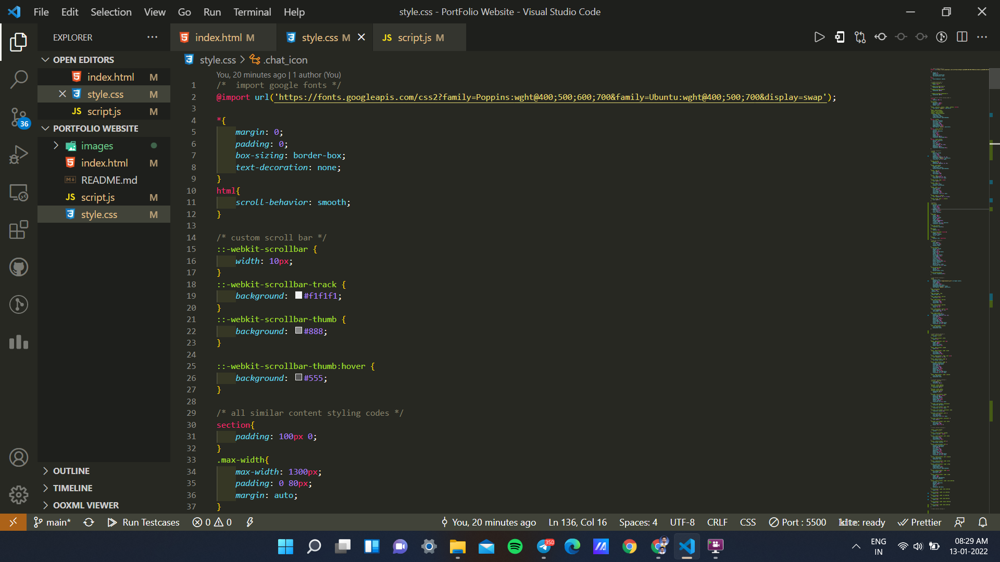

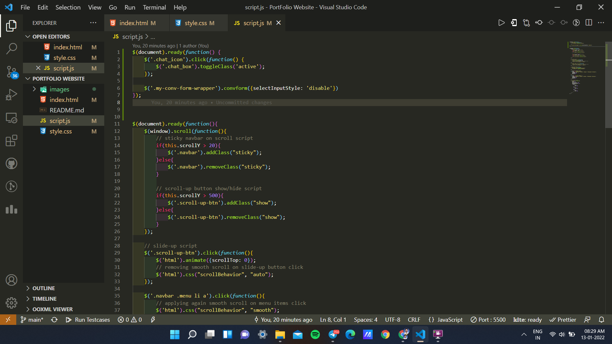

- QnA MAKER BOT 
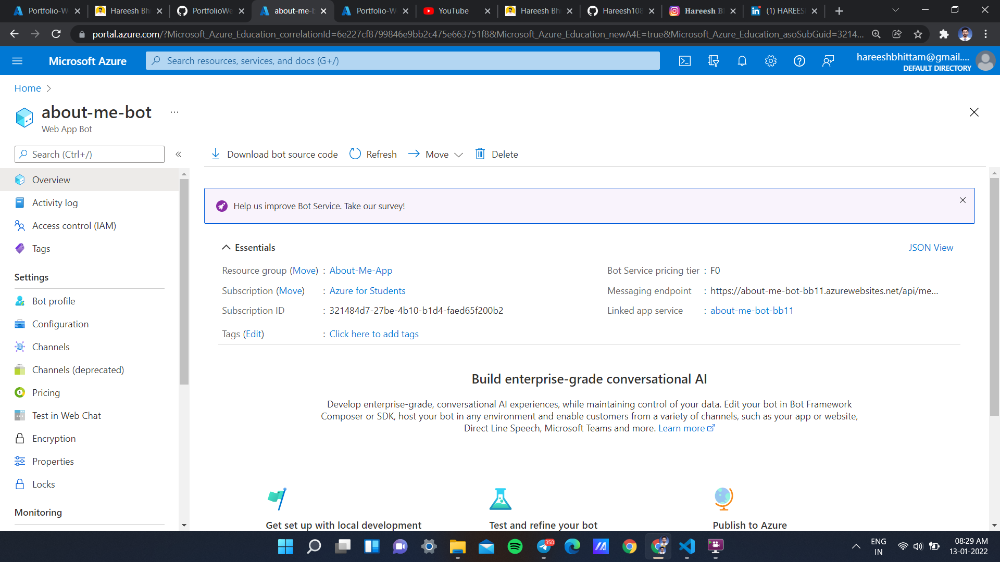

- DEPLOYMENT
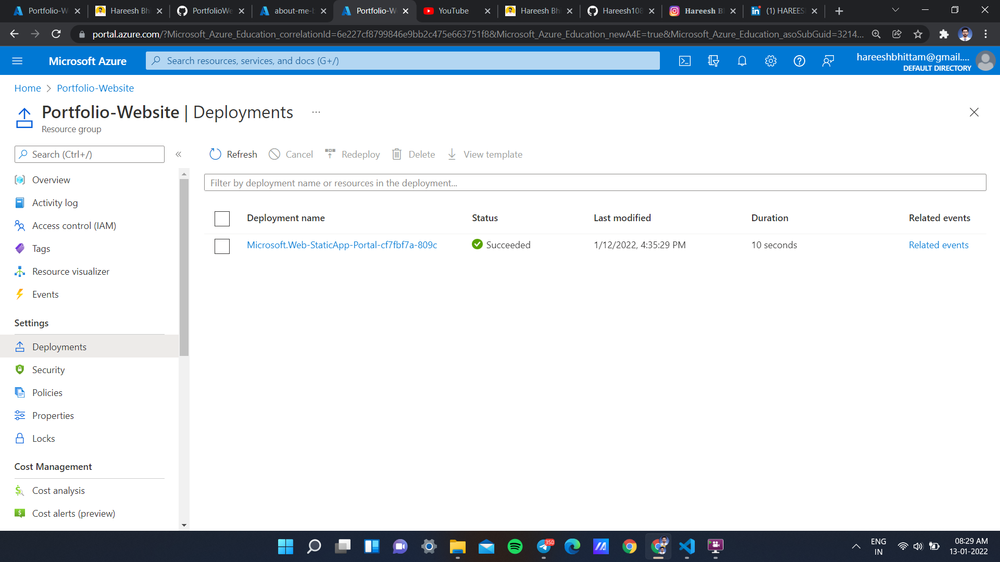

- RESOURSE GROUP
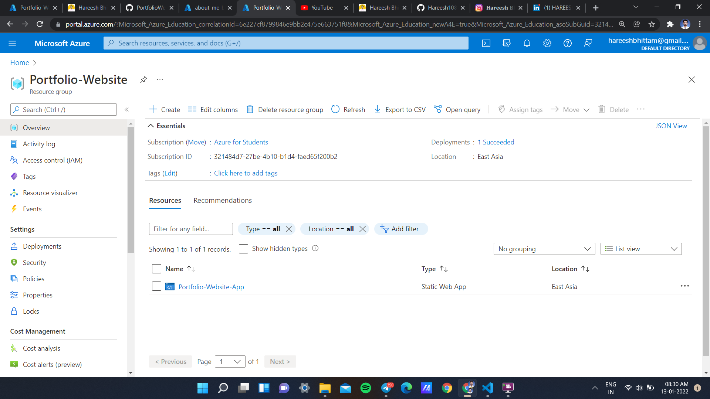

- STATIC WEB APP
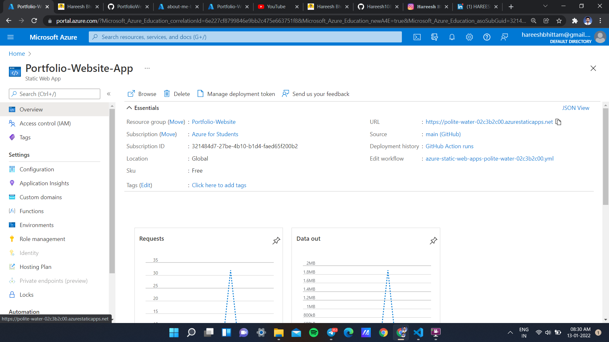

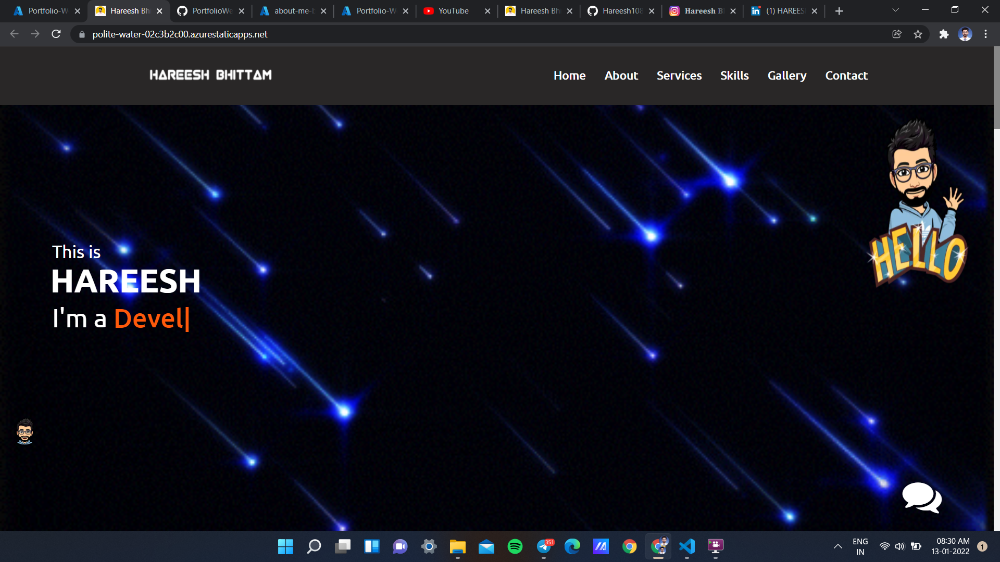

- ACTUAL IMPLEMENTED CHAT BOT
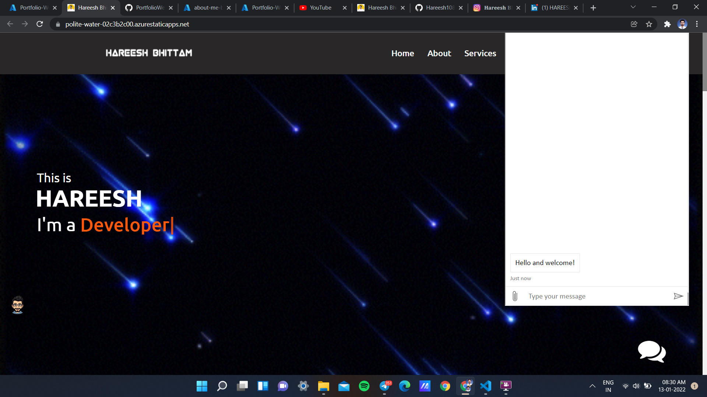

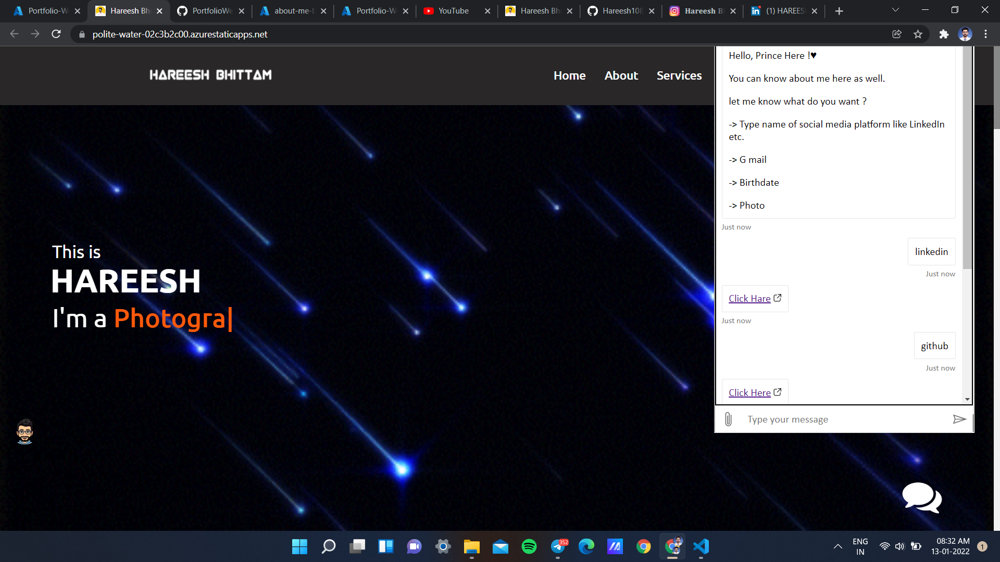

- GITHUB REPO...
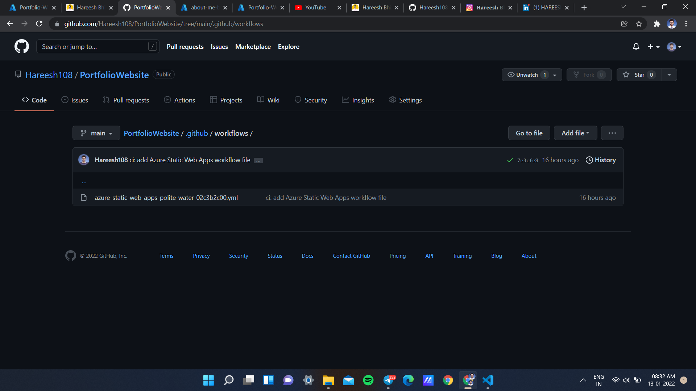

Thank You :)

- Hareesh Devaba Bhittam
- hareeshbhittam@gmail.com
